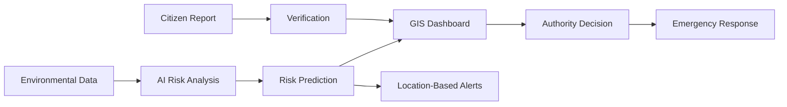
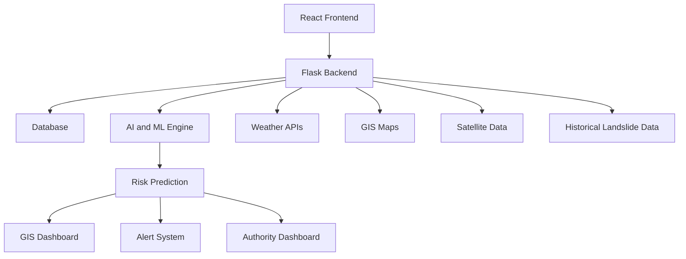
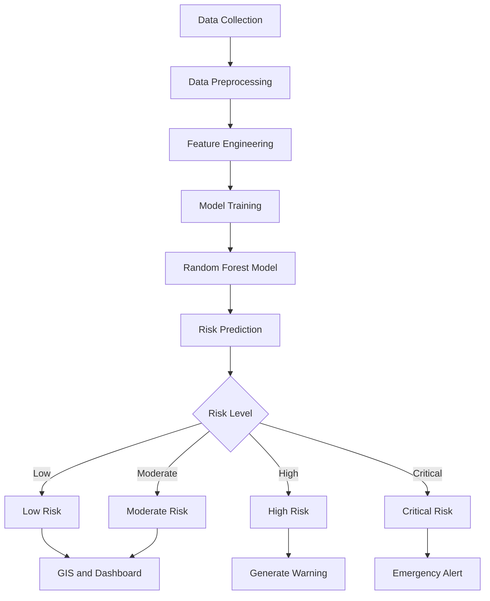
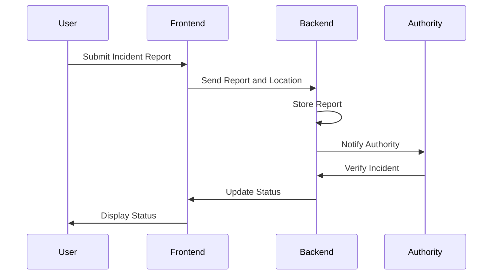

# Product Requirements Document (PRD)

# PahadSuraksha AI

## AI-Based Early Warning and Landslide Risk Monitoring System for the North Eastern Region (NER)

**Product Type:** Disaster Risk Intelligence Platform
**Target Region:** North Eastern Region (NER), India

---

# 1. Product Overview

## 1.1 Product Name

**PahadSuraksha AI**

## 1.2 Product Vision

To build a scalable AI-powered disaster intelligence platform that helps identify landslide risks early, enables timely warnings, and supports authorities and local communities in taking preventive action across the North Eastern Region of India.

## 1.3 Product Summary

PahadSuraksha AI is an AI-based landslide risk monitoring and early warning platform designed for regions vulnerable to landslides, slope failures, road blockages, and extreme rainfall.

The platform combines environmental, geographical, historical, and citizen-generated data to identify potential high-risk zones. It provides risk predictions, GIS-based visualization, incident reporting, location-based alerts, road connectivity information, and decision-support dashboards.

The system is designed to support multiple stakeholders, including local communities, field officials, disaster management authorities, district administrations, and travellers.

---

# 2. Problem Statement

The North Eastern Region frequently experiences landslides, flash floods, slope failures, and road blockages due to heavy rainfall, fragile terrain, and environmental changes.

Current monitoring and response systems often face the following challenges:

* Disaster information is often received after an incident occurs.
* Monitoring of vulnerable locations is largely reactive.
* Environmental and geographical data is spread across multiple sources.
* Remote communities may face communication and connectivity challenges.
* Road blockages can isolate villages and delay emergency response.
* Authorities may lack a unified real-time view of risk conditions.
* Citizen and field reports are not always integrated into a centralized system.

There is a need for a scalable platform that can analyze multiple data sources, identify potential landslide risks, and provide timely information to relevant stakeholders.

---

# 3. Product Goals

## 3.1 Primary Goals

* Identify potential landslide-prone areas using AI and environmental data.
* Provide location-based risk information and early warnings.
* Support disaster management authorities with real-time monitoring.
* Improve awareness among local communities.
* Enable citizens and field officials to report incidents.
* Visualize vulnerable locations using GIS maps.
* Support emergency response prioritization.

## 3.2 Secondary Goals

* Monitor road connectivity and reported blockages.
* Build a scalable architecture for multiple NER states.
* Support low-network and offline reporting.
* Enable future integration with sensors and satellite data.

---

# 4. Non-Goals

The initial version of PahadSuraksha AI will not:

* Guarantee exact prediction of every landslide event.
* Replace official disaster management authorities.
* Automatically trigger emergency operations without authority validation.
* Provide medical or rescue services directly.
* Cover all natural disasters in the first release.
* Depend entirely on citizen reports for risk prediction.

---

# 5. Target Users

## 5.1 Local Communities

People living in landslide-prone or remote areas.

### Needs

* Early warnings
* Local risk information
* Simple incident reporting
* Information in understandable formats
* Low-network accessibility

---

## 5.2 Travellers and Drivers

People travelling through vulnerable roads and mountainous areas.

### Needs

* Road connectivity information
* Landslide alerts
* Route risk information
* Incident updates

---

## 5.3 Field Officials

Government or disaster management personnel working in affected locations.

### Needs

* Incident reporting
* Geo-tagged evidence
* Risk information
* Location monitoring

---

## 5.4 Disaster Management Authorities

Organizations responsible for disaster preparedness and response.

### Needs

* Centralized monitoring
* Risk dashboards
* Incident verification
* Emergency prioritization
* Location-based alerts

---

## 5.5 District Administrations

Local government authorities responsible for affected districts.

### Needs

* District-level risk overview
* Infrastructure status
* Community alerts
* Emergency response information

---

# 6. User Personas

## Persona 1: Local Community Member

**Name:** Community User

**Goal:** Receive timely warnings and report dangerous situations.

**Pain Points:**

* Limited information about potential risks.
* Delayed communication.
* Poor network connectivity.
* Difficulty reporting incidents to authorities.

---

## Persona 2: Field Officer

**Name:** Field Official

**Goal:** Report and verify incidents from affected locations.

**Pain Points:**

* Manual reporting processes.
* Delayed communication.
* Lack of centralized information.
* Difficulty tracking incident status.

---

## Persona 3: Disaster Management Officer

**Name:** Disaster Authority

**Goal:** Monitor risks and prioritize emergency response.

**Pain Points:**

* Multiple disconnected data sources.
* Delayed incident information.
* Difficulty identifying priority areas.
* Lack of real-time risk visualization.

---

# 7. User Journey



---

# 8. Product Scope

## 8.1 MVP Scope

The MVP will include:

### Risk Monitoring

* Location-based risk prediction
* Risk severity classification
* Weather data integration
* Historical data integration

### GIS Map

* Interactive map
* Risk zones
* Incident markers
* Road status

### Incident Reporting

* Report submission
* Location information
* Severity level
* Photo upload
* Description

### Authority Dashboard

* Risk overview
* Reported incidents
* High-risk locations
* Incident management

### Alerts

* Location-based alerts
* Risk notifications
* Authority notifications

---

## 8.2 Future Scope

The platform may later include:

* IoT soil moisture sensors
* Satellite image analysis
* Deep learning models
* Mobile applications
* Multilingual voice alerts
* SMS alerts
* Offline synchronization
* Flash flood prediction
* Multi-disaster monitoring
* Advanced route safety analysis

---

# 9. Functional Requirements

## FR-01: User Authentication

The system should allow users to register and log in.

### User Roles

* Community User
* Traveller
* Field Official
* Authority / Admin

### Requirements

* User registration
* Login
* Role-based access
* Secure authentication

---

## FR-02: Risk Prediction

The system should analyze available data and generate a risk prediction.

### Input Data

* Rainfall
* Temperature
* Humidity
* Terrain information
* Slope data
* Historical landslide records
* Soil moisture where available

### Output

* Low Risk
* Moderate Risk
* High Risk
* Critical Risk

---

## FR-03: GIS Visualization

The system should provide an interactive GIS map.

### Features

* Risk zone visualization
* Incident locations
* Road information
* Vulnerable locations
* Location search

---

## FR-04: Incident Reporting

Users should be able to report incidents.

### Required Information

* Incident type
* Location
* Description
* Severity

### Optional Information

* Photo
* Video
* Additional comments

---

## FR-05: Geo-Tagged Reporting

The system should support location-based reports.

### Requirements

* Latitude
* Longitude
* Timestamp
* Location name

---

## FR-06: Incident Verification

Authorities should be able to review submitted reports.

### Actions

* Approve
* Reject
* Mark as under review
* Update severity

---

## FR-07: Alerts

The system should generate alerts based on:

* Risk level
* Location
* Weather conditions
* Verified incidents

### Alert Types

* Risk alert
* Road blockage alert
* Landslide alert
* Emergency warning

---

## FR-08: Authority Dashboard

Authorities should be able to view:

* Current risk levels
* High-risk zones
* Reported incidents
* Road connectivity
* Weather information
* Emergency priorities

---

## FR-09: Road Connectivity Monitoring

The system should display:

* Open roads
* Blocked roads
* High-risk roads
* Reported road incidents

---

## FR-10: Offline Support

The system should support:

* Offline incident reporting
* Local storage
* Automatic synchronization when connectivity returns

---

# 10. Non-Functional Requirements

## Performance

* APIs should provide responses efficiently.
* Maps should load progressively.
* The system should support increasing data volume.

## Scalability

The architecture should support:

* Multiple districts
* Multiple states
* Multiple users
* Large environmental datasets

## Security

The system should:

* Secure user authentication.
* Protect user information.
* Validate API requests.
* Restrict authority functions.

## Reliability

The system should:

* Handle temporary network failures.
* Preserve offline reports.
* Maintain data consistency.

## Usability

The platform should provide:

* Simple interfaces.
* Clear risk levels.
* Easy reporting.
* Accessible information.

---

# 11. System Architecture



---

# 12. Technology Stack

## Frontend

**React.js**

Used for:

* Interactive UI
* Dashboards
* GIS maps
* Incident reporting
* Risk visualization

---

## Backend

**Python Flask**

Used for:

* REST APIs
* Business logic
* Data processing
* AI model integration
* User management

---

## AI/ML

**Random Forest**

Used to analyze environmental and geographical factors and classify landslide risk.

Future models may include:

* XGBoost
* Neural Networks
* Deep Learning
* Ensemble models

---

## Database

**PostgreSQL**

Used for production-scale data storage.

**SQLite**

Can be used during local development and MVP testing.

---

## Maps

**Leaflet.js**

Used for interactive mapping.

**OpenStreetMap**

Used for map and geographical data.

---

# 13. Data Sources

## Weather Data

Weather APIs available through RapidAPI can provide:

* Rainfall
* Temperature
* Humidity
* Weather conditions
* Forecast data

Reference:

https://rapidapi.com/

---

## Maps

Leaflet.js:

https://leafletjs.com/

OpenStreetMap:

https://www.openstreetmap.org/

---

## Geological and Landslide Data

USGS:

https://www.usgs.gov/

---

## Satellite Data

NASA Earthdata:

https://www.earthdata.nasa.gov/

---

# 14. AI Risk Prediction Flow



---

# 15. Incident Reporting Flow



---

# 16. Success Metrics

The product will be evaluated using:

## System Metrics

* Number of risk predictions generated
* API response time
* System availability
* Data processing time

## User Metrics

* Number of active users
* Number of incident reports
* Number of verified reports
* Alert engagement

## Prediction Metrics

* Model accuracy
* Precision
* Recall
* F1 Score

## Impact Metrics

* Time between risk detection and alert generation
* Time taken for incident verification
* Number of high-risk areas identified

---

# 17. Validation Strategy

## Data Validation

* Validate data sources before model training.
* Remove incomplete and duplicate data.
* Verify geographical information.

## Model Validation

Evaluate the model using:

* Training data
* Testing data
* Cross-validation

Metrics:

* Accuracy
* Precision
* Recall
* F1 Score

---

## User Validation

Test the platform with:

* Local users
* Field officials
* Students and researchers
* Disaster management stakeholders

Collect feedback regarding:

* Ease of use
* Alert clarity
* Report submission
* Dashboard usability

---

# 18. Risks and Mitigation

| Risk                        | Impact | Mitigation                                   |
| --------------------------- | ------ | -------------------------------------------- |
| Incomplete data             | Medium | Use multiple verified sources                |
| Incorrect prediction        | High   | Display risk probability and validate models |
| Poor network connectivity   | High   | Offline reporting and synchronization        |
| False citizen reports       | Medium | Authority verification                       |
| API availability issues     | Medium | Support multiple data sources                |
| Large-scale data processing | High   | Use scalable cloud architecture              |

---

# 19. Assumptions

* Environmental data will be available from public or authorized sources.
* Authorities will verify critical reports.
* Users will provide location information when reporting incidents.
* Internet connectivity may not always be available in remote areas.
* The system will initially operate as a decision-support and early warning platform.

---

# 20. Dependencies

The product depends on:

* Weather APIs
* GIS map services
* Environmental datasets
* Historical landslide data
* Satellite datasets
* Cloud infrastructure
* Internet and mobile connectivity

---

# 21. Product Roadmap

## Phase 1: Research and Planning

* Study NER landslide challenges.
* Identify datasets.
* Define users.
* Define system architecture.

---

## Phase 2: Data and AI Development

* Collect datasets.
* Preprocess data.
* Select features.
* Train Random Forest model.
* Evaluate prediction performance.

---

## Phase 3: Backend Development

* Develop APIs.
* Integrate database.
* Connect AI model.
* Implement authentication.

---

## Phase 4: Frontend Development

* Develop user interface.
* Implement GIS maps.
* Build reporting system.
* Build dashboards.

---

## Phase 5: Integration

* Connect frontend and backend.
* Integrate weather APIs.
* Integrate maps.
* Connect AI predictions.

---

## Phase 6: Testing

* Functional testing.
* API testing.
* Model validation.
* User testing.

---

## Phase 7: Deployment

* Deploy frontend.
* Deploy backend.
* Configure database.
* Monitor system.

---

# 22. Future Product Vision

PahadSuraksha AI can evolve from a landslide monitoring system into a broader disaster intelligence platform.

Future capabilities may include:

```text
Landslide Monitoring
        |
        v
Flood Monitoring
        |
        v
Road Risk Monitoring
        |
        v
Environmental Intelligence
        |
        v
Multi-Disaster Intelligence Platform
```

The long-term vision is to create a scalable platform that combines AI, environmental data, GIS, citizen reporting, and real-time monitoring to support disaster preparedness and climate-resilient governance.

---

# 23. Acceptance Criteria

The MVP will be considered functional when:

* [ ] Users can access the platform.
* [ ] Weather data is successfully integrated.
* [ ] Risk predictions can be generated.
* [ ] Risk levels are displayed.
* [ ] GIS maps display locations and risks.
* [ ] Users can submit incident reports.
* [ ] Reports include location information.
* [ ] Authorities can review reports.
* [ ] Road status can be displayed.
* [ ] Alerts can be generated based on risk levels.
* [ ] Dashboard displays risk information.
* [ ] Core APIs are functional.

---

# 24. Conclusion

PahadSuraksha AI is designed as a scalable AI-powered disaster intelligence and early warning platform for the North Eastern Region of India.

By combining AI-based risk prediction, environmental data, GIS visualization, satellite information, weather monitoring, and citizen reporting, the platform aims to help local communities and authorities identify risks early and take informed preventive action.

The system will initially focus on landslide risk monitoring and can later evolve into a comprehensive multi-disaster intelligence platform.

---

**Product:** PahadSuraksha AI
**Category:** Disaster Risk Intelligence
**Target Region:** North Eastern Region, India
**Status:** Proposed / Under Development
