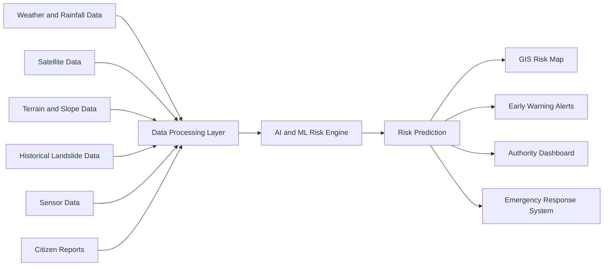
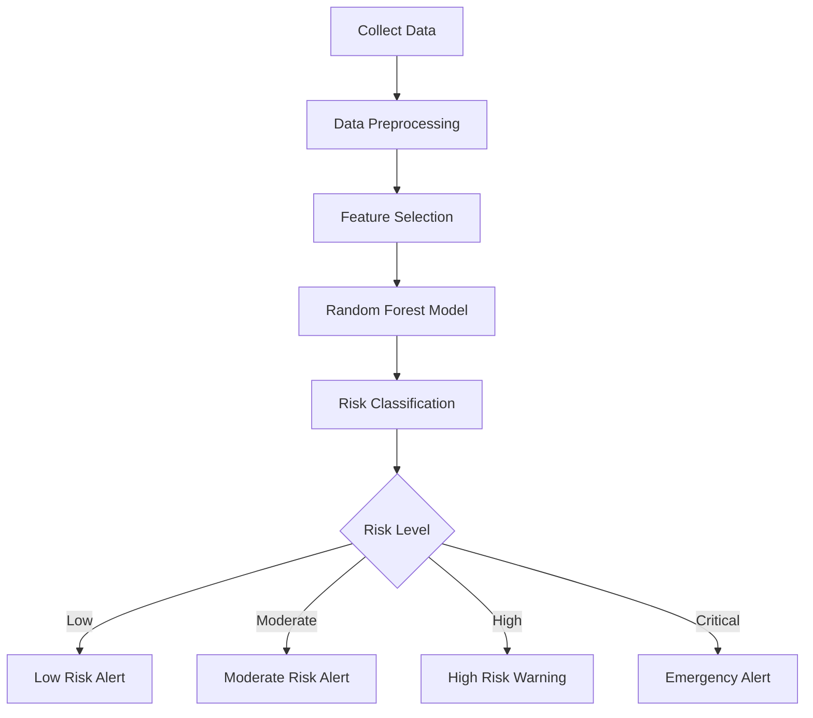
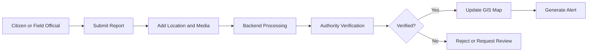
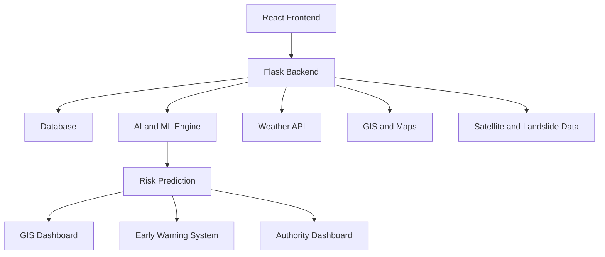
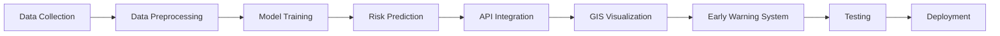
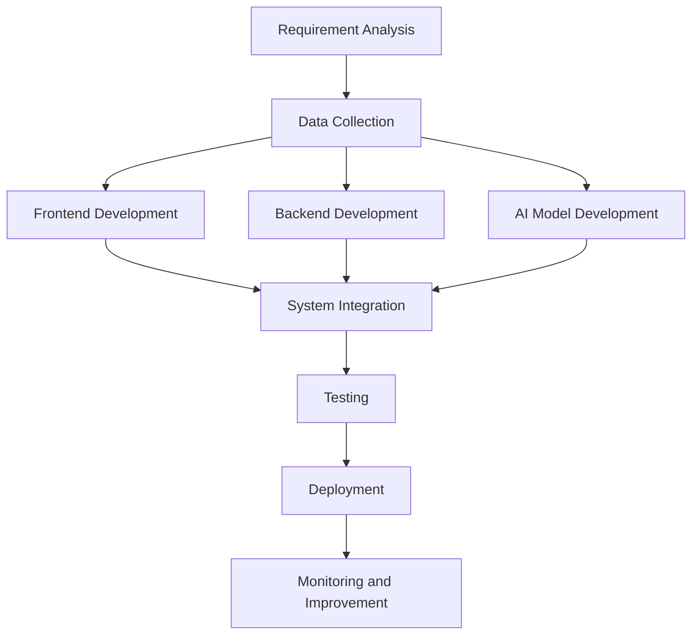
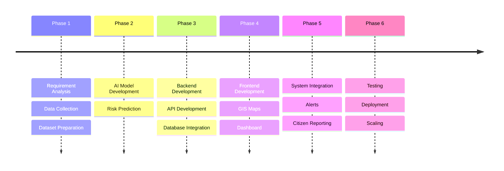

# PahadSuraksha AI

## AI-Based Early Warning and Landslide Risk Monitoring System for the North Eastern Region (NER)

> Predicting Risk. Enabling Early Action. Protecting Communities.

---

## Problem Statement

The North Eastern Region (NER) frequently experiences landslides, flash floods, road blockages, and slope failures due to heavy rainfall, fragile terrain, and unplanned hill cutting. These incidents disrupt connectivity, damage infrastructure, delay emergency response, and isolate remote communities.

Currently, monitoring of vulnerable zones is often reactive and dependent on manual reporting. There is limited use of real-time predictive systems for identifying high-risk zones and issuing early warnings to authorities and local communities.

---

## Proposed Solution

PahadSuraksha AI is an AI-powered early warning and landslide risk monitoring platform designed for the North Eastern Region of India.

The system analyzes rainfall, weather conditions, terrain data, soil moisture, satellite data, historical landslide records, and citizen reports to identify high-risk zones and predict possible landslide events.

It provides real-time risk monitoring, GIS visualization, location-based alerts, incident reporting, and dashboards for authorities and local communities.

---

## System Overview



---

## Objectives

* Predict potential landslide risks using AI and ML.
* Identify and monitor high-risk zones across the NER.
* Provide timely alerts to authorities and local communities.
* Improve disaster preparedness and emergency response.
* Visualize vulnerable roads, villages, and infrastructure using GIS.
* Enable citizens and field officials to report incidents.
* Support scalable monitoring across multiple North Eastern states.

---

## Target Region

The platform is designed for the North Eastern Region of India:

* Arunachal Pradesh
* Assam
* Manipur
* Meghalaya
* Mizoram
* Nagaland
* Sikkim
* Tripura

The architecture is designed to support monitoring at district, state, and regional levels.

---

## Key Features

### AI-Based Risk Prediction

The AI model analyzes multiple environmental and geographical factors:

* Rainfall
* Weather conditions
* Soil moisture
* Terrain and slope
* Historical landslide records
* Satellite observations

Risk levels include:

| Risk Level | Description                          |
| ---------- | ------------------------------------ |
| Low        | Normal environmental conditions      |
| Moderate   | Increased monitoring required        |
| High       | Potential landslide conditions       |
| Critical   | Immediate preventive action required |

---

## Risk Prediction Flow



---

## GIS-Based Risk Monitoring

The interactive GIS dashboard visualizes:

* High-risk zones
* Vulnerable roads
* Villages
* Critical infrastructure
* Reported incidents
* Landslide-prone areas
* Road connectivity status

The system uses location-based visualization to help authorities identify and prioritize vulnerable areas.

---

## Real-Time Weather Monitoring

The platform integrates weather data to monitor environmental conditions that can increase landslide risk.

Data includes:

* Rainfall
* Temperature
* Humidity
* Wind
* Weather conditions
* Forecast information

---

## Citizen and Field Reporting

Citizens and field officials can report:

* Landslides
* Road blockages
* Cracks
* Slope movement
* Infrastructure damage

Reports may include:

* Location
* Description
* Photo
* Video
* Severity level
* Time of reporting

---

## Reporting Workflow



---

## Early Warning System

The platform generates location-based warnings for:

* Local communities
* District administrations
* Disaster management authorities
* Field officials
* Travellers and drivers

Possible notification channels include:

* Web application
* Mobile application
* SMS
* Push notifications

---

## Road Connectivity Monitoring

The platform monitors road conditions and displays:

* Open roads
* Blocked roads
* High-risk routes
* Reported incidents
* Alternative route information

This helps authorities prioritize emergency response and helps travellers make safer decisions.

---

## Authority Dashboard

The centralized dashboard provides:

* Current risk severity levels
* High-risk locations
* Weather-linked risk forecasts
* Reported incidents
* Road connectivity status
* Emergency response priorities

---

## Offline and Low-Network Support

The platform is designed for remote areas through:

* Offline data collection
* Local data storage
* Automatic synchronization
* Low-bandwidth optimization

---

# Technology Stack

## Frontend

**React.js**

React.js is used to build a responsive and interactive user interface for risk monitoring, maps, alerts, dashboards, and citizen reporting.

---

## Backend

**Python Flask**

Flask handles APIs, data processing, business logic, AI model integration, and communication between the frontend and backend.

---

## AI/ML Model

**Random Forest**

The Random Forest model analyzes environmental and geographical factors such as rainfall, weather, terrain, soil moisture, and historical data to predict landslide risk.

---

## Database

**PostgreSQL / SQLite**

The database stores:

* User information
* Incident reports
* Risk predictions
* Historical records
* Location information

---

## Maps and GIS

**Leaflet.js**

Leaflet.js is used for interactive maps and location-based visualization.

**OpenStreetMap**

OpenStreetMap provides geographical and map data.

---

## Data Sources and References

| Source               | Purpose                                |
| -------------------- | -------------------------------------- |
| Leaflet.js           | Interactive maps and GIS visualization |
| OpenStreetMap        | Roads and geographical map data        |
| RapidAPI Weather API | Weather and rainfall data              |
| USGS                 | Landslide and geological datasets      |
| NASA Earthdata       | Satellite and Earth observation data   |

### Reference Links

* Leaflet.js: https://leafletjs.com/
* OpenStreetMap: https://www.openstreetmap.org/
* RapidAPI: https://rapidapi.com/
* USGS: https://www.usgs.gov/
* NASA Earthdata: https://www.earthdata.nasa.gov/

---

# System Architecture



---

# Implementation Process



---

## Development Flow



---

# Feasibility

* Uses existing AI/ML, GIS, satellite, weather API, and cloud technologies.
* Can integrate data from multiple sources for large-scale risk monitoring.
* Modular architecture allows gradual implementation and scaling.
* Web and mobile applications can support remote and low-network areas.

---

# Viability

* Provides early warnings to help reduce disaster impact.
* Supports authorities in emergency response prioritization.
* Can be integrated with existing disaster management systems.
* Can scale across all states and districts of the North Eastern Region.

---

# Expected Impact

PahadSuraksha AI aims to:

* Reduce loss of life caused by landslides.
* Improve disaster preparedness.
* Reduce infrastructure damage.
* Improve emergency response.
* Improve road connectivity awareness.
* Support local communities with early warnings.
* Strengthen climate-resilient disaster management.

---

# Target Users

* Local communities
* Travellers and drivers
* District administrations
* Disaster management authorities
* Field officials
* Road and infrastructure authorities
* Emergency response teams

---

# Future Scope

Future versions may include:

* Advanced deep learning models
* IoT soil moisture sensor integration
* Satellite image analysis
* Multilingual voice alerts
* Automated SMS notifications
* Mobile application
* Offline synchronization
* Route safety recommendations
* Flash flood risk prediction
* Multi-disaster monitoring

---

# Project Structure

```text
PahadSuraksha-AI/
│
├── frontend/
│   └── React Application
│
├── backend/
│   └── Flask Application
│
├── model/
│   └── Random Forest Model
│
├── data/
│   └── Datasets
│
├── docs/
│   ├── PRD.md
│   ├── architecture.md
│   └── data-sources.md
│
└── README.md
```

---

# Implementation Roadmap



---

# PahadSuraksha AI

**AI-Based Early Warning and Landslide Risk Monitoring System for the North Eastern Region**

Predicting Risk. Enabling Early Action. Protecting Communities.
